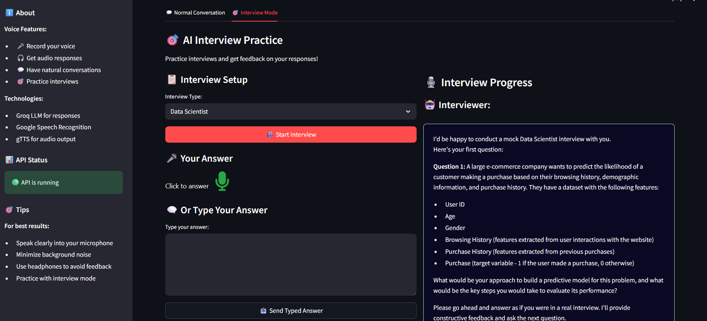
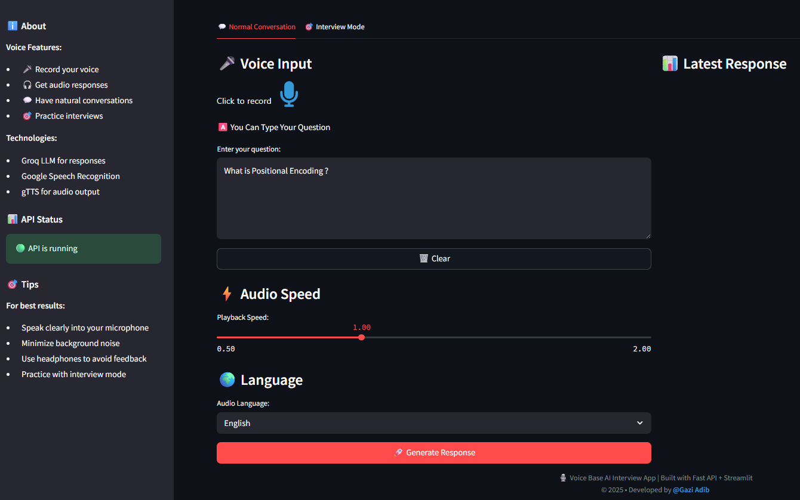
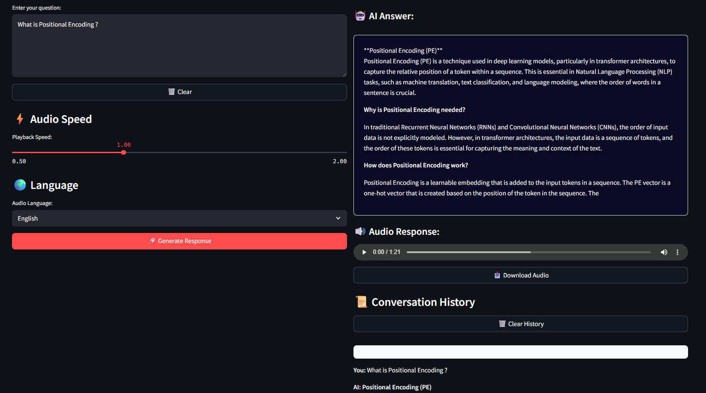
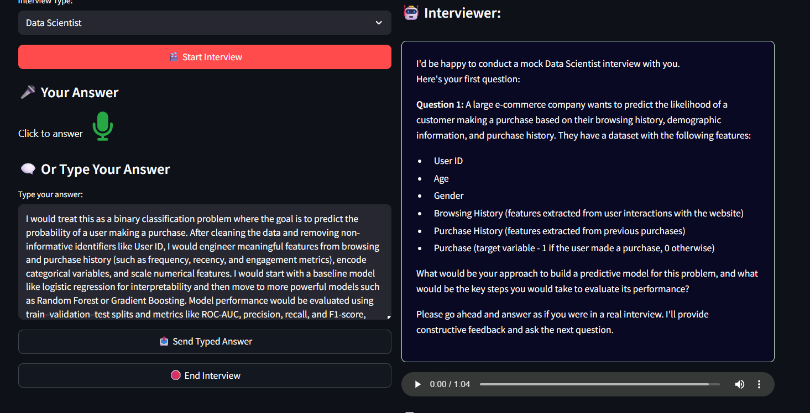
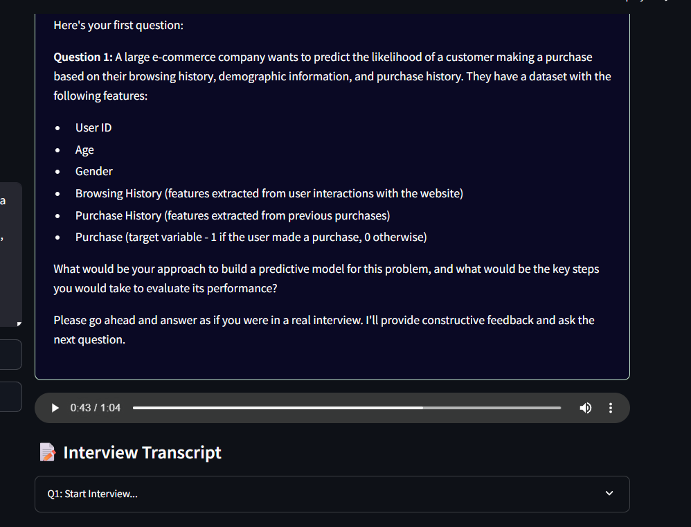
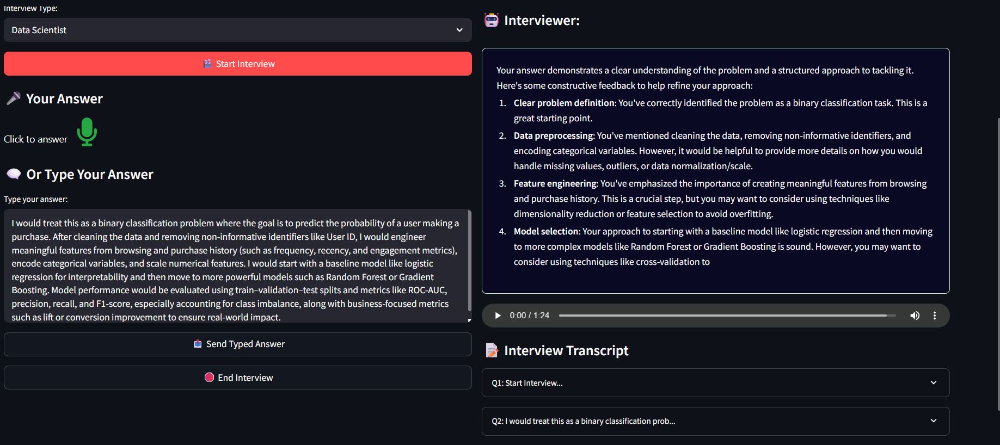
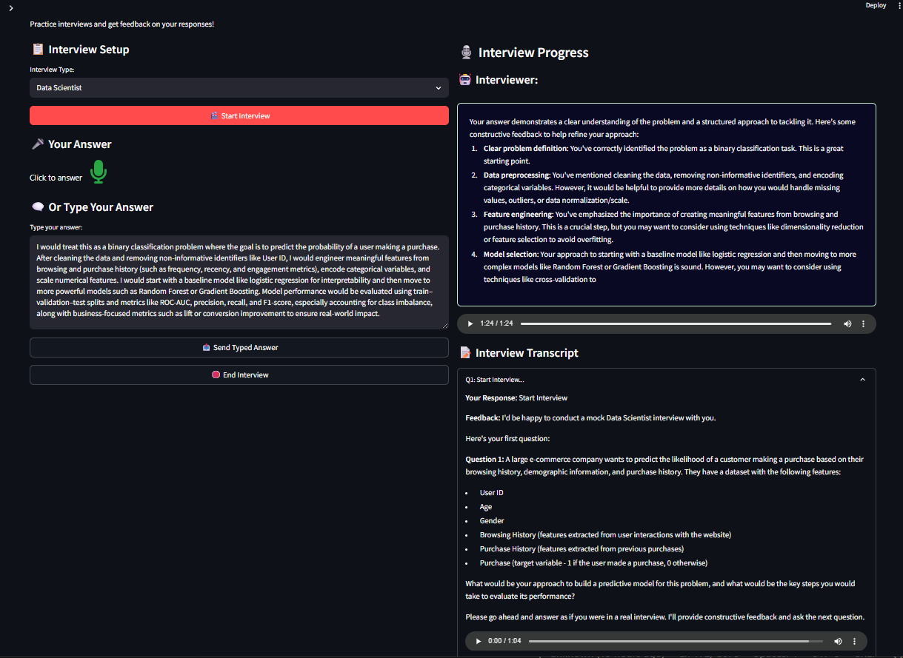
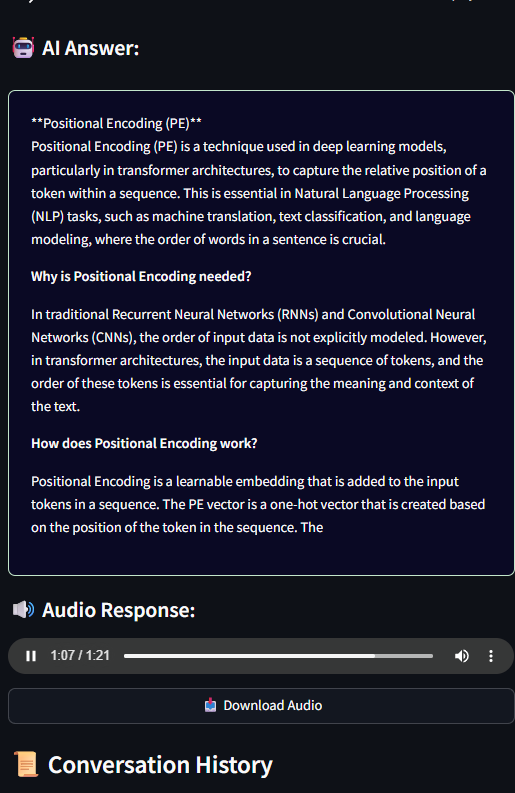

# 🎙️ Voice-Based AI Interview Practice App

An intelligent **voice-enabled AI interview platform** that allows users to practice interviews through **voice or text**, receive **AI-generated feedback**, and listen to **audio responses** — all in a clean, interactive UI built with **Streamlit** and powered by **FastAPI**.

> Designed to simulate real interview experiences based on user-selected roles (e.g., Data Scientist) and provide structured feedback to help users improve.

---

## 🚀 Key Features

### 🗣️ Voice & Text Interaction
- 🎤 **Voice input** using speech recognition
- ⌨️ **Text-based input** for questions and answers
- 🔊 **Audio responses** generated via Text-to-Speech (TTS)

### 🤖 AI Interviewer
- Role-based interview questions (e.g., Data Scientist)
- AI-generated answers and **constructive feedback**
- Supports **follow-up questions** and full interview flow

### 📊 Interview Feedback
- Detailed feedback on:
  - Problem understanding
  - Feature engineering
  - Model selection
  - Evaluation strategy
- Feedback available in **both text and audio**

### 🧠 Conversation Memory
- Stores **conversation history**
- Displays full **interview transcripts**
- Replay previous AI responses with audio

### 🌐 Modern UI
- Dark-themed, professional interface
- Mobile-friendly layout
- Clear separation between:
  - Normal conversation
  - Interview mode

---

## 🖼️ Screenshots

### 🔹 Interview Start Page

### 🔹 Normal Voice Conversation

### 🔹 Main Conversational Voice Page

### 🔹 AI Interview – Text Answer

### 🔹 AI Interview – Audio Playback

### 🔹 AI Interview – Feedback with Audio

### 🔹 Full Interview Script & Transcript

### 🔹 Mobile View with Conversation History

---

## 🧰 Tech Stack

### 🔧 Backend
- **FastAPI** – High-performance API backend
- **Groq LLM** – AI-generated interview questions, answers & feedback

### 🎨 Frontend
- **Streamlit** – Interactive UI & state management
- Custom dark UI styling

### 🔊 Voice & Audio
- **Google Speech Recognition** – Speech-to-text
- **Google gTTS** – Text-to-speech (audio responses)

### 🧠 AI & Logic
- Role-based interview logic
- Conversation memory & history tracking
- Audio speed & language controls

---

## 🏗️ Architecture Overview

